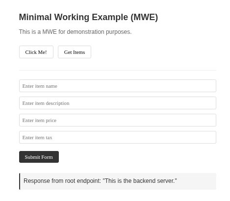

# MWE: Express.js Frontend with FastAPI Backend and MongoDB



A minimal working example (MWE) demonstrating a full-stack web application architecture with:
- **Frontend**: Express.js server serving static HTML/CSS/JS
- **Backend**: FastAPI (Python) providing REST API endpoints
- **Database**: MongoDB for data persistence

## Installation

Clone the repository
```bash
git clone https://github.com/a-mhamdi/devops-mwe.git
cd devops-mwe
```

## Setup and Usage

1. **Backend (FastAPI)**
   ```bash
   cd backend
   uv venv
   source .venv/bin/activate
   uv pip install -r requirements.txt
   uvicorn server:app --reload --host 0.0.0.0 --port 8000
   ```

2. **Frontend (Express.js)**
   ```bash
   cd ../frontend
   npm i
   npm run dev
   ```

3. **MongoDB**
   - Ensure MongoDB is running on your system
   - Default connection: `mongodb://localhost:27017`
   - Update connection string in `backend/server.py` if needed

4. **Access the Application**
   - Frontend: http://localhost:3000
   - Backend API: http://localhost:8000
   - API Documentation: http://localhost:8000/docs (FastAPI auto-generated)

## Docker Setup

1. **Build Docker Images**
   ```bash
   docker build -t backend-image ./backend
   docker build -t frontend-image ./frontend
   ```

2. **Run Containers**
   ```bash
   docker run -d --name backend-container -p 8000:8000 backend-image
   docker run -d --name frontend-container -p 3000:3000 frontend-image
   ```

## Jenkins CI/CD

   - Use the provided `Dockerfile` and `jenkins.yml` to set up a **Jenkins** server with Docker support.
   - Mount a persistent volume for **Jenkins** data.
   ```bash
   docker compose -f jenkins.yml up --build -d
   ```
> [!WARNING]
> Ensure **Jenkins** has permissions to run **Docker** commands. You may need to adjust group permissions based on your host system configuration. To do so, you need to know the **Docker** socket's group `GID`. For example, you can run this command and update the `GID` in the file `jenkins.yml` accordingly.
> ```bash
> getent group docker # Look at the number (group ID)
> ```